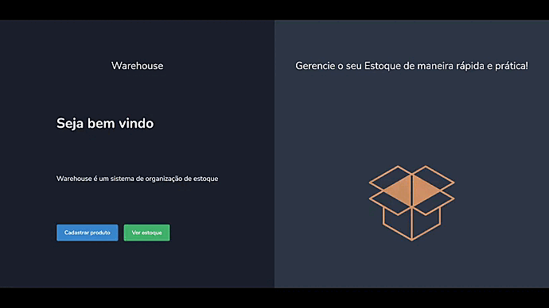

<h1 align="center"> 🚀🚀 Warehouse 🚀🚀</h1>
<h2 align="center">Sistema de almoxarifado</h2>
<br>
<div align="center">
  
</div>

## 💻 Projeto com o objetivo de realizar gerenciamento do estoque.
<br>
<p align="center">
  
</p>
## 🧪 Tecnologias

Esse projeto foi feito com as seguintes tecnologias:

- [ReactJS](https://reactjs.org)
- [TypeScript](https://www.typescriptlang.org/)
- [NodeJS](https://nodejs.org/en/)
- [Express](https://expressjs.com/)
- [Typeorm](https://typeorm.io/)
- [PostgreSQL](https://www.postgresql.org/)
- [Axios](https://www.npmjs.com/package/axios)

---

```bash

# Clone o repositório
$ git clone https://github.com/arthurfortunato/warehouse.git
# Acesse a pasta do backend do projeto no prompt de comando
$ cd backend

# Instale as dependências
$ yarn

# Execute o script "start"
$ yarn dev

# O projeto inciará na porta: 4000 

# Acesse a pasta do frontend do projeto no prompt de comando
$ cd frontend

# Instale as dependências 
$ yarn

# Execute o script "start"
$ web: yarn start